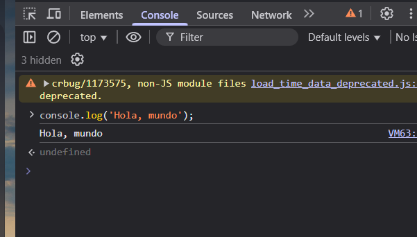
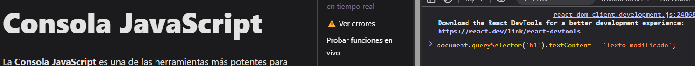
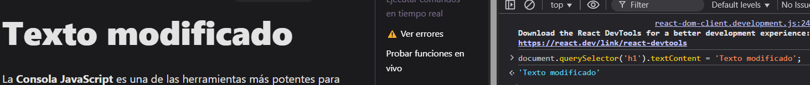
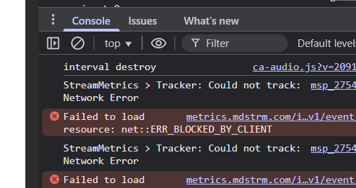

# Consola JavaScript

La **Consola JavaScript** es una de las herramientas más potentes para desarrolladores. Permite interactuar directamente con la página web, ejecutar comandos, ver errores y probar funciones en tiempo real.

###  Ejecutar comandos en tiempo real



Podés escribir código JavaScript directamente en la consola. Esto te permite:

- Probar snippets de código rápidamente
- Interactuar con elementos del DOM
- Llamar funciones ya definidas en el sitio

```js
document.querySelector('h1').textContent = 'Texto modificado';
```




### ⚠️ Ver errores



Todos los errores y advertencias que ocurren en la página se muestran aquí:

- **Errores de sintaxis**: Problemas en el código JavaScript que impiden su ejecución.
- **Fallos de red**: Peticiones fallidas, como recursos no encontrados o APIs que no responden.
- **Problemas de CORS**: Errores relacionados con la política de seguridad de los navegadores.
- **Variables no definidas**: Advertencias cuando intentas acceder a una variable que no existe.

Esto te ayuda a detectar y corregir bugs de forma rápida.

###  Probar funciones en vivo

Podés probar cualquier función que esté definida en tu código:


