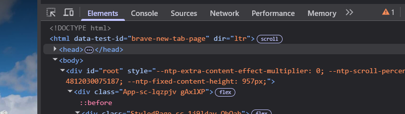

# Panel "Elements" (HTML)

El panel **Elements** permite visualizar y manipular la estructura HTML de la página en tiempo real. Es una de las herramientas más potentes del Inspector.

### 🧭 Cómo navegar el DOM

El DOM (Document Object Model) representa la estructura de la página. Podés navegar entre los elementos HTML como si fueran carpetas y subcarpetas.

- Hacé clic en las flechas que aparecen al lado de las etiquetas para expandir o contraer su contenido.
- Al seleccionar un elemento, se resaltará en la página.

### 🔽 Expandir/colapsar nodos

- Clic en la flecha a la izquierda de una etiqueta para ver su contenido.
- Shift + clic en la flecha expande todos los nodos hijos de forma recursiva.

### 🏷️ Ver atributos, clases, IDs

En el panel podés ver directamente los **atributos** del elemento seleccionado:

- `class`: clases CSS aplicadas.
- `id`: identificador único.
- Otros atributos como `href`, `src`, `alt`, `data-*`, etc.

### ✏️ Añadir, editar o eliminar HTML

- **Editar**: doble clic sobre una etiqueta o atributo para modificarlo.
- **Añadir**: clic derecho > "Edit as HTML" o "Add attribute".
- **Eliminar**: clic derecho sobre el nodo > "Delete element".

Todos los cambios son **temporales** y solo afectan tu navegador mientras la página esté abierta.
