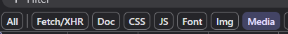
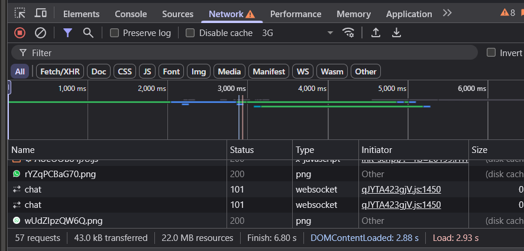
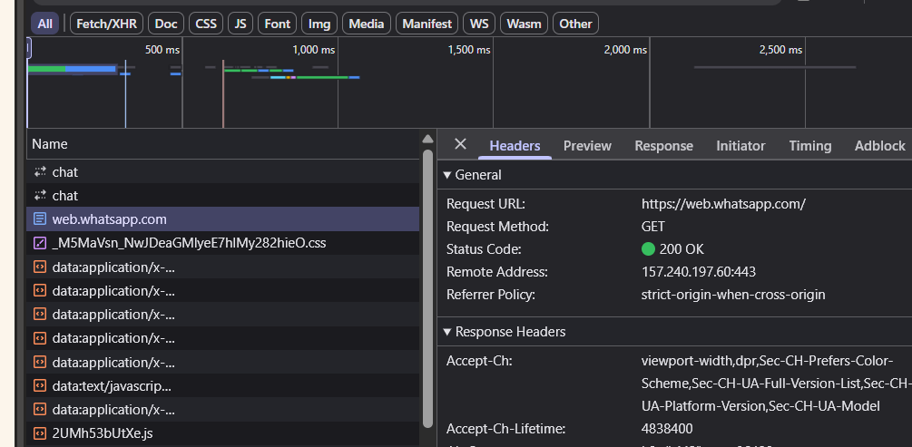

# Panel de Red (Network)

El Panel de Red (Network) en las herramientas de desarrollo del navegador te permite inspeccionar todas las solicitudes que realiza una página web. Esto incluye archivos estáticos como imágenes, hojas de estilo y scripts, así como solicitudes dinámicas a APIs. Es una herramienta crucial para analizar el rendimiento de la página y depurar problemas de red.

### Ver archivos cargados

El Panel de Red muestra todos los archivos que la página solicita durante su carga, como imágenes, scripts, hojas de estilo y otros recursos. Esto te permite ver qué archivos están siendo solicitados y si hay algún problema con la carga de estos archivos.

- **Filtrar por tipo de archivo:** Puedes filtrar los tipos de archivos cargados (como imágenes, scripts, CSS, etc.) usando los botones de filtro disponibles en la parte superior del panel.
- **Ver detalles de cada solicitud:** Al hacer clic en cualquier solicitud, se puede ver detalles como el código de estado HTTP, el tamaño del archivo, y el tiempo de carga.

**Ejemplo:** 
Si una imagen no se carga correctamente, podrás ver en el panel si la solicitud devuelve un error 404 o algún otro código de error.

### Analizar tiempos de carga

El Panel de Red te permite ver el tiempo que tarda en cargarse cada recurso de la página. Esto es útil para identificar cuellos de botella en el rendimiento de la web, como recursos que tardan mucho en descargarse.

- **Tiempo de carga total:** En la columna de "Duración" podrás ver cuánto tiempo tardó cada archivo en descargarse desde que se hizo la solicitud hasta que se completó.
- **Ver el tiempo de respuesta:** También puedes ver el tiempo de respuesta de las solicitudes, lo que te permite identificar si el servidor está tardando demasiado en responder.

**Ejemplo:**
Si una página tarda mucho en cargar, puedes observar en el panel qué recursos están tardando más tiempo en cargarse, y optimizarlos (por ejemplo, comprimiendo imágenes o usando almacenamiento en caché).

### Ver respuestas de APIs

El Panel de Red también muestra las solicitudes a APIs realizadas por la página. Puedes ver tanto las solicitudes (como las peticiones `GET` o `POST`) como las respuestas (como los datos en formato JSON o XML).

- **Inspeccionar respuestas de APIs:** Al seleccionar una solicitud de API en el panel, puedes ver la respuesta del servidor. Esto es útil para verificar los datos que la página recibe del servidor y depurar problemas relacionados con las APIs.
- **Ver el código de estado HTTP:** Puedes ver el código de estado de la respuesta, como `200 OK`, `404 Not Found`, o `500 Internal Server Error`, lo que te ayudará a entender si la solicitud fue exitosa o si ocurrió algún error.

**Ejemplo:**
Si una API no responde correctamente, podrás ver la solicitud y la respuesta en el panel, lo que te permitirá verificar si hay un error en el servidor o en la solicitud.
