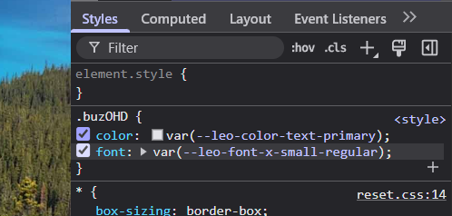

# Panel "Styles" (CSS)

El panel **Styles** te permite ver y modificar los estilos CSS aplicados a cualquier elemento de la página, en tiempo real. Es una herramienta clave para diseñadores y desarrolladores front-end.

### 👁️ Ver estilos aplicados

Al seleccionar un elemento en el panel "Elements", el panel "Styles" muestra todas las reglas CSS que se aplican a él, incluyendo:

- Selectores usados (`.clase`, `#id`, `elemento`)
- Propiedades (`color`, `margin`, `display`, etc.)
- Archivo de origen y número de línea

### 🛠️ Modificar estilos en tiempo real

Podés hacer clic en cualquier propiedad CSS para editar su valor. Los cambios se reflejan inmediatamente en la página, lo que facilita pruebas rápidas de diseño.

También podés agregar nuevas propiedades escribiéndolas directamente.

### ✅ Activar/desactivar propiedades

Cada regla tiene una casilla de verificación al lado. Al desactivarla, esa propiedad se omite sin eliminarla, útil para hacer pruebas visuales rápidas.

### 📚 Estilos heredados y prioridades

El panel también muestra:

- **Estilos heredados** desde elementos padres.
- **Prioridad** de reglas (las tachadas son sobreescritas).
- Uso de `!important` que fuerza una propiedad sobre otras.

Estas funciones te ayudan a entender **por qué un estilo se aplica o no**, y cómo resolver conflictos entre reglas.

