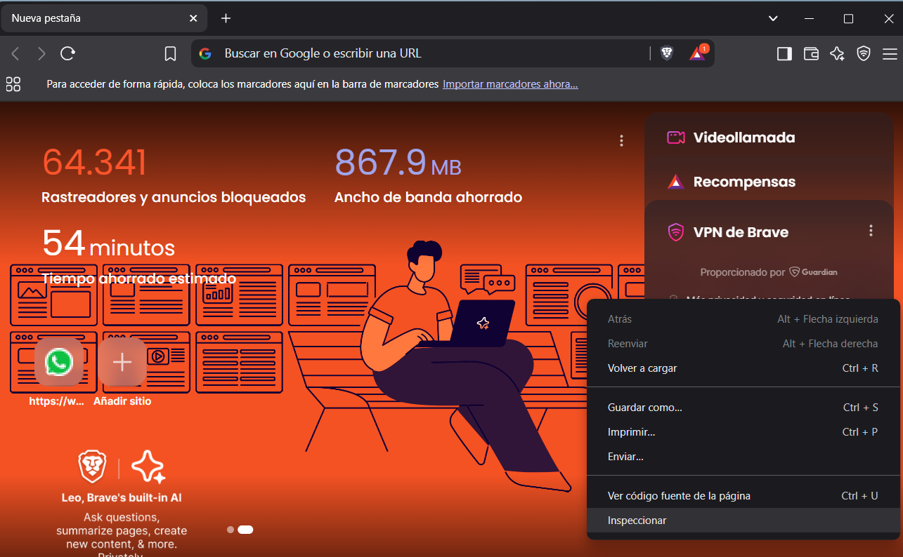
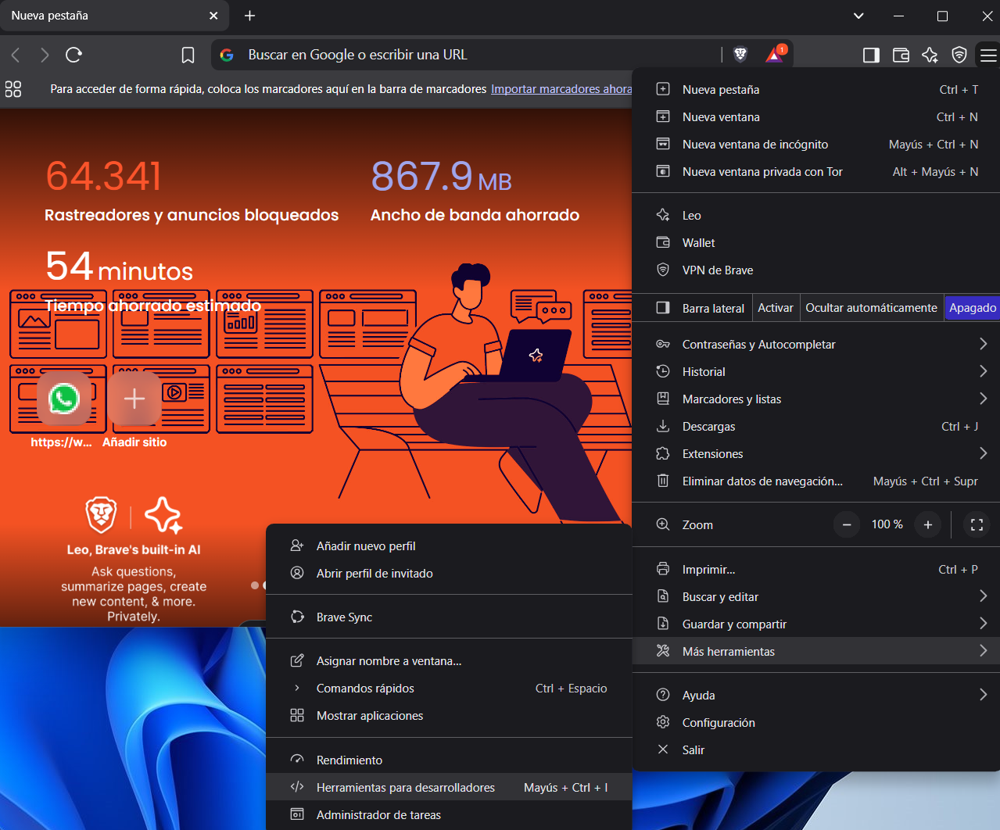

# Como Acceder al Inspector

### ⌨️ Atajos de teclado

El método más rápido para abrir el Inspector de Elementos es usando un atajo de teclado. Aquí están los más comunes para los navegadores más populares:

- **Google Chrome / Microsoft Edge**: `Ctrl + Shift + I` (Windows/Linux) o `Cmd + Option + I` (Mac)
- **Mozilla Firefox**: `Ctrl + Shift + I` (Windows/Linux) o `Cmd + Option + I` (Mac)
- **Safari**: `Cmd + Option + I` (Mac)

### 🖱️ Clic derecho + "Inspeccionar"

Otra forma rápida de acceder al Inspector es hacer clic derecho en cualquier parte de la página y seleccionar **"Inspeccionar"** o **"Inspeccionar elemento"**.

### 📂 Abrir desde el menú del navegador

También puedes acceder al Inspector desde el menú de herramientas del navegador:

1. **Google Chrome / Microsoft Edge / Firefox**:  
   Ve al menú (tres puntos en la esquina superior derecha) > **Más herramientas** > **Herramientas para desarrolladores**.

2. **Safari**:  
   Ve al menú **Desarrollador** (si no está habilitado, actívalo en las preferencias de Safari) > **Mostrar inspector web**.