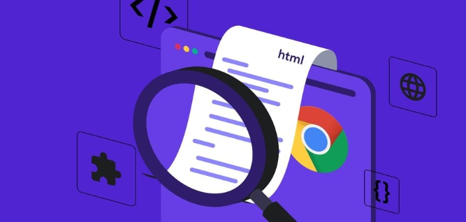

# Introduccion

Let's discover **Docusaurus in less than 5 minutes**.

## ¿Qué es el Inspector de Elementos?

              

El Inspector de Elementos es una herramienta que viene integrada en los navegadores modernos (como Chrome, Firefox, Edge,etc). Permite explorar y modificar el código **HTML**, **CSS** y **JavaScript** de cualquier página web en tiempo real, directamente desde tu navegador.

## ¿Para qué sirve?

El Inspector de Elementos es esencial para los desarrolladores web, diseñadores y testers. Permite:

- **Visualizar** la estructura y el diseño de una página web.
- **Editar estilos** y experimentar con cambios en tiempo real.
- **Depurar código**, analizar errores y optimizar el rendimiento.
- **Comprobar la accesibilidad** y la adaptabilidad en diferentes dispositivos.

## Casos de usos comunes

- **Debugging:** Encontrar y solucionar errores en el código de una página web.

- **Pruebas de diseño:** Modificar el diseño y los estilos sin necesidad de editar los archivos originales.

- **Exploración de código:** Ver cómo están construidos los sitios web, especialmente útil para aprender buenas prácticas de desarrollo.

- **Pruebas de compatibilidad:** Comprobar cómo se ve y se comporta una página en distintos dispositivos y resoluciones.